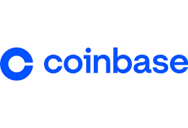
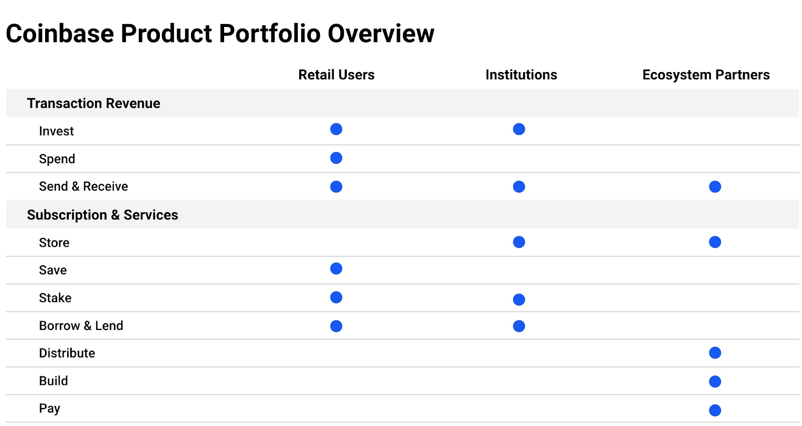
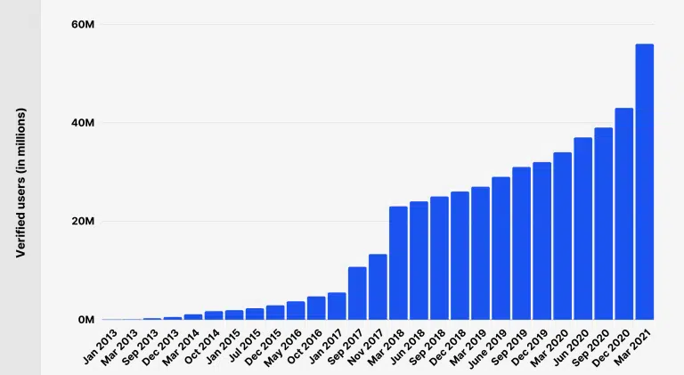
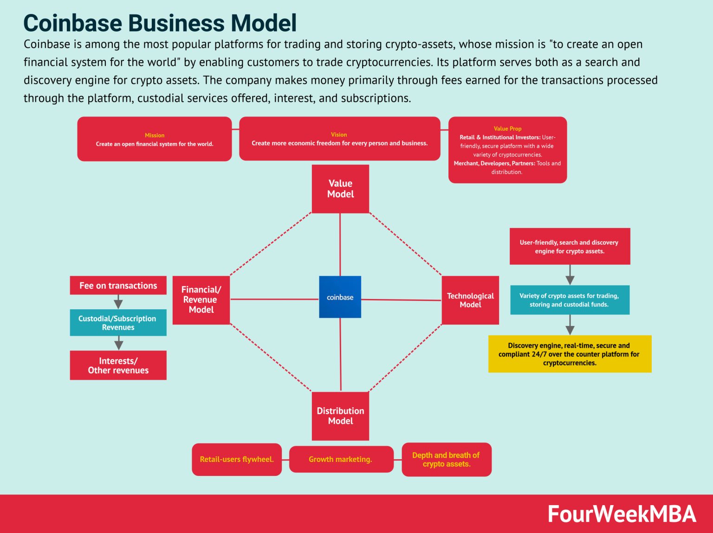

# Coinbase Case Study
## Overview and Origin

Coinbase is a digital platform for trading and storing cryptocurrencies. It makes money via transaction fees, subscriptions, commissions earned on custodial funds, and interests earned on these. Coinbase took its name from the content of the “input” of a generation transaction that has no parent transaction outputs, and it is called “coinbase.” In simple words, it’s the first transaction of a new block.

Coinbase is building the cryptoeconomy – a more fair, accessible, efficient, and transparent financial system enabled by crypto. The company started in 2012 with the radical idea that anyone, anywhere, should be able to easily and securely send and receive Bitcoin. Today, Coinbase offers a trusted and easy-to-use platform for accessing the broader cryptoeconomy.

Coinbase was founded in June 2012 by Brian Armstrong, a former Airbnb engineer. While at Airbnb, he saw the difficulties of sending money to South America. He began working weekends and nights to write code in Ruby and JavaScript to buy and store cryptocoins. Armstrong applied for Y Combinator incubation but was told to find a co-founder to proceed and had only three days to find one. He posted on Hacker News for a co-founder explaining his mission, which went viral and garnered massive interest on Reddit as well. This is when Armstrong met Ehrsam, a Goldman Sachs trader. The duo joined hands and obtained a $150,000 funding infusion from the startup incubator program at Y Combinator. 

Armstrong and Ehram started raising funds to build Coinbase and, in May 2013, raised a $5 million Series A investment from New-York based venture capital firm Union Square Ventures, with Fred Wilson serving as the lead investor. Wilson, co-founder of Union Square Ventures, is well known for his earlier investments in successful companies including Twitter, Tumblr, Zynga, Foursquare, Etsy and more. 

In December 2013, Coinbase raised another $25 million from Andreessen Horowitz, Ribbit Capital and other investors. Presently, Coinbase has 76 investors and has raised a total of $498.7 million in funding over 18 rounds. Ehrsam left the company in 2017 with a 6% stake but still serves on the board of directors and was part of the company’s audit committee before its April 2021 public offering.

On April 14, 2021, Coinbase went public via a direct stock listing and was listed on the NASDAQ as COIN. Coinbase opened at $381 per share, valuing the company at $99.6 billion, and briefly touched a market capitalization of $100 billion, which was 10 times higher than Coinbase’s last private valuation. The valuation rivaled the likes of Facebook and Airbnb when they went public.

## Business Activities
Coinbase is building the cryptoeconomy – a more fair, accessible, efficient, and transparent financial system enabled by crypto.Today, they offer a trusted and easy-to-use platform for accessing the broader cryptoeconomy.

Coinbase ecosystem combines retail customers, institutions, and other partners (like merchants and developers).The tech platform focuses on cybersecurity, compliance, and expansion of Blockchain protocols over time.

Here are some core user statistics of Coinbase:
1. Coinbase Global Inc. had 56 million verified users in August 2023 and could reach 150 million verified users before the end of 2023.
2. Every month, about 6.1 million users at Coinbase execute at least one transaction.
3. The crypto exchange has a total valuation of $18 billion in 2022.
4. Coinbase generated a revenue of $3.1 billion in 2022.
5. It recorded an annual loss of $2.6 billion in 2022.
6. Coinbase holds 11.3% of the entire crypto market capitalization.
7. Coinbase Global has over 3,400 employees.
8. It recorded about 9 million active users who performed more than one transaction in a month in 2022.
9. An average of the total number of Coinbase users have crypto assets that are worth more than $5,000.
10. The company gets 86% of its total generated revenue from transaction fees.

In 2021, Coinbase raked in $7.8 billion in total revenue while clearing $3.6 billion in net profit. For Q1 2022, revenue stood at $1.17 billion.As of 2023, the company boasts a valuation of around $18.6 billion and an enterprise value of approximately $16.5 billion. 

One of the critical issues that former crypto exchange platforms had encountered were all related to security, scalability, and regulatory compliance, all things that Coinbase has been able to successfully address so far.

Coinbase focuses on providing a stable and secure platform for trading and storing crypto assets. Its technological infrastructure addresses issues of security, scalability, and regulatory compliance. It's technological model is based on its end-to-end financial infrastructure, where customers can buy dozens of crypto assets, secure them and find various options to store these assets.

  
## Landscape

Cryptocurrency is electronic money that gets stored in e-wallets or computer files. Plus, it can be transferred and tracked using blockchain technology. 

The crypto space is bustling with newfound interest. It has become more popular globally. However, since cryptocurrencies are still the new kid on the block, there is much to unravel and learn about them. Here are the major trends and innovations of cryptocurrency over next few year.
1. DEFI (decentralized fiance). DeFi applications, offer a range of financial services, including lending, borrowing, trading, and investing. These services are facilitated by smart contracts, which automate the process of borrowing and lending money.
2. NFT (non-fungible tokens). NFTs are digital assets representing ownership of a unique item or piece of content, such as artwork, music, or even tweets. Unlike other cryptocurrencies like Bitcoin or Ethereum, which are fungible (meaning that they can be exchanged for one another), NFTs are unique and cannot be exchanged for another asset on a one-to-one basis.
3. STABLECOINS. Stablecoins are a type of cryptocurrency designed to maintain a stable value, usually pegged to a traditional asset such as the US dollar or gold. They offer the benefits of cryptocurrencies, such as fast and borderless transactions, but without the volatility that comes with other cryptocurrencies, such as Bitcoin or Ethereum.
4. CENTRAL BANK DIGITAL CURRENCIES (CBDCS). CBDCs are also an integral part of trends in cryptocurrency. They are designed to offer the same advantages as cryptocurrencies such as Bitcoin and Ethereum, but with the added benefit of being backed by a government or central bank. This makes them more stable and less volatile than other cryptocurrencies and could make them a more attractive option for businesses and consumers.

The 10 largest crypto companies in the world nowadays are:
1. Binance
2. Coinbase
3. International Business Machines Corporation (IBM)
4. Grayscale
5. OpenSea
6. Sandbox
7. Gemini (Gemini Trust Company)
8. Kraken
9. Uniswap
10. Chainalysis

## Results

Coinbase has had a significant and multifaceted impact on the cryptocurrency industry. While its contributions to accessibility, infrastructure development, and regulatory engagement. It is important to mention that coinbase has actively engaged with regulators and policymakers, advocating for sensible regulations that protect consumers while fostering innovation. This has helped shape the regulatory landscape for cryptocurrency and legitimize its place within the financial system.
But there are also many concerns regarding its centralized nature, environmental impact, and market dependence.

There are three core metrics that crypto companies use to measure success:
1. User Acquisition and Engagement
2. Revenue and Financial Performance
3. Institutional Adoption

Impacted significantly by the broader market downturn in crypto, Coinbase performed not very well in the past two years.

User Acquisition and Engagement: User growth has slowed down compared to its peak in 2021, but MTUs remain relatively stable. Trading volume has declined significantly.

1. Revenue and Financial Performance: Transaction revenue has plummeted due to lower trading volume, impacting profitability. However, subscription and services revenue has seen some growth.

2. Institutional Adoption: Assets on platform have increased, suggesting continued trust from institutional clients. However, institutional trading volume hasn't kept pace with retail volume, indicating a potential slowdown in their activity.

3. Coinbase's direct competitor is Biance, both in terms of trading volumes and market capitalization. Biancde is currently the world’s largest exchange in terms of the daily trading volume of cryptocurrencies. 

Binance has earned a reputation as an exchange that sometimes has carried out some business activities before asking for permission, which has caused further regulatory issues. Acting without too many restrictions certainly favors more rapid innovation, which the exchange has shown over time and other platforms. However, it has also caused closer scrutiny from authorities. 

However, Coinbase has primarily succeeded in staying on the right path on the regulatory side. Coinbase appears more secure, considering it never had significant attacks since its inception and more transparent about its steps to keep customers’ funds safe.
  
## Recommendations

Coinbase's transaction fees are the most criticized aspect of the company.Coinbase has a lot of ways you can pay for crypto, and they can carry different fees that are at times hard to understand. While Coinbase discloses fees to users before completing a transaction, they are difficult to look up ahead of time. This can make life difficult for people who are choosing an exchange for the first time and who are sensitive to fees. And overall, some competitors do charge less. 

Lower transfer fees may have there pros:
1. Increased competition: Lower fees would make Coinbase more competitive with other crypto exchanges, potentially attracting new users who are price-sensitive.
2. Higher trading volume: Lower fees could incentivize users to trade more frequently, leading to increased trading volume and revenue for Coinbase.
3. Improved user experience: High fees can be a barrier to entry for new users and a frustration for existing ones. Lowering fees could create a more positive user experience and attract new customers.

The crypto exchange space is highly competitive, with numerous established and emerging platforms vying for market share. Coinbase is a leading crypto exchange with strong recognition and a large user base. However, there's room for improvement innovating, improving user experience, and offering more competitive fees.By continuously innovating, improving user experience, and offering more competitive fees, Coinbase can stay ahead in the fierce competition within the crypto exchange landscape.

## References
1. https://investor.coinbase.com/home/
2. https://cointelegraph.com/learn/who-is-brian-armstrong (How coinbase was found by Brian Armstrong)
3. https://techreport.com/statistics/coinbase-user-statistics/#:~:text=Key%20Coinbase%20User%20Statistics,-Coinbase%20Global%20Inc&text=The%20crypto%20exchange%20has%20a,the%20entire%20crypto%20market%20capitalization. (Key Coinbase User Statistics)
4. https://www.axon.dev/blog/new-trends-in-cryptocurrency-for-2023-2025#:~:text=New%20trends%20in%20cryptocurrency%2C%20such,of%20borrowing%20and%20lending%20money. (New trends in cryptocurrency for 2023-2025)
5. https://history-computer.com/10-largest-crypto-companies/ (The 10 Largest Crypto Companies In The World)
6. https://fourweekmba.com/coinbase-business-model/#:~:text=As%20a%20growth%20strategy%2C%20Coinbase,digital%20channels%20for%20continuous%20growth. (Coinbase business model and Product portfolio overview)
7. https://cointelegraph.com/learn/binance-vs-coinbase-how-do-they-compare (Compare between Biance and Coinbase)
8. https://www.nerdwallet.com/reviews/investing/brokers/coinbase (Coinbase Review 2023: Pros, Cons and How It Compares)

[images](images)